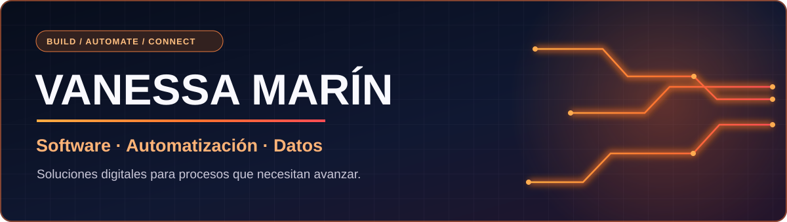

  
    
  <strong>CEO de MasterKey · Desarrollo software, automatizaciones y productos digitales que resuelven problemas reales.</strong>
    
  
  
  
  
    
  <a href="#sobre-mí">Sobre mí</a> · <a href="#soluciones">Soluciones</a> ·
  <a href="#proyectos-destacados">Proyectos</a> · <a href="#tecnologías">Tecnologías</a>

### Sobre mí

Soy Vanessa, CEO de <strong>MasterKey</strong> y desarrolladora enfocada en crear soluciones digitales útiles y sostenibles. Trabajo desde el análisis de una necesidad hasta el desarrollo, la integración y la puesta en marcha.

Me interesan especialmente la **automatización**, las **aplicaciones web**, los **datos** y las **integraciones** que reducen tareas manuales y ayudan a los equipos a trabajar mejor.

<strong>MasterKey</strong> · Empresa propia · <a href="https://masterkey.com/">masterkey.com ↗</a> 
Software development · Process automation · Systems integration · Data

### Soluciones

| Enfoque | Lo que desarrollo |
| :--- | :--- |
|  | Flujos con validaciones y trazabilidad que convierten tareas repetitivas en procesos confiables. |
|  | Herramientas web y servicios que conectan necesidades de negocio con software usable. |
|  | Conexiones entre plataformas, bases de datos y equipos mediante reglas claras. |
|  | Tableros y asistentes para consultar información y apoyar decisiones. |

### Proyectos destacados

<table>
<tr>
<td width="33%" valign="top">
  
<strong><a href="https://www.cuidartecol.org/">CuidArte ↗</a></strong> 
Sitio público de CuidArte para conocer sus iniciativas y formas de participar.  
🌐 Sitio disponible
</td>
<td width="34%" valign="top">
  
<strong>SmartKey</strong> 
Sistema de inventario TI inteligente.  
🔒 Repositorio privado
</td>
<td width="33%" valign="top">
  
<strong>ALICE</strong> 
Proyecto de agente inteligente.  
🔒 Repositorio privado
</td>
</tr>
</table>

Los repositorios privados se presentan por su propósito y alcance. El código y los detalles reservados permanecen privados.

### Tecnologías

Automatización · Nube · Contenedores · Backend · Base de datos

  <strong>¿Tienes una idea o un proceso que podemos mejorar?</strong> 
  Me interesa colaborar en proyectos donde el software genere resultados concretos.

